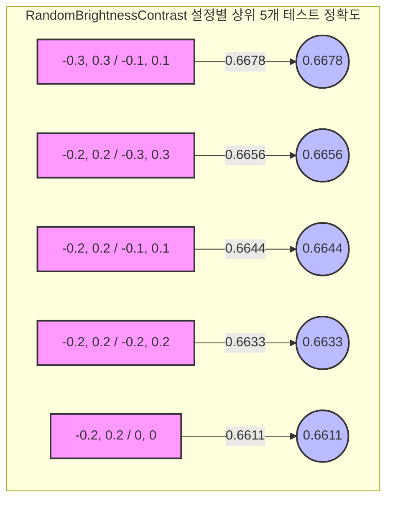

| Brightness Limit | Contrast Limit | 확률 | 훈련 정확도 | 훈련 F1 점수 | 테스트 정확도 |
|------------------|----------------|------|------------|-------------|--------------|
| (-0.2, 0.2) | (-0.2, 0.2) | 0.0 | 0.6750 | 0.6668 | 0.6389 |
| (-0.1, 0.1) | (0, 0) | 0.5 | 0.6931 | 0.6876 | 0.6578 |
| (-0.2, 0.2) | (0, 0) | 0.5 | 0.6764 | 0.6733 | 0.6611 |
| (-0.3, 0.3) | (0, 0) | 0.5 | 0.6667 | 0.6593 | 0.6378 |
| (0, 0) | (-0.1, 0.1) | 0.5 | 0.6861 | 0.6784 | 0.6311 |
| (0, 0) | (-0.2, 0.2) | 0.5 | 0.6833 | 0.6808 | 0.6478 |
| (0, 0) | (-0.3, 0.3) | 0.5 | 0.6528 | 0.6451 | 0.6500 |
| (-0.1, 0.1) | (-0.1, 0.1) | 0.5 | 0.6806 | 0.6764 | 0.6533 |
| (-0.1, 0.1) | (-0.2, 0.2) | 0.5 | 0.7097 | 0.7048 | 0.6533 |
| (-0.1, 0.1) | (-0.3, 0.3) | 0.5 | 0.6833 | 0.6767 | 0.6533 |
| (-0.2, 0.2) | (-0.1, 0.1) | 0.5 | 0.6917 | 0.6869 | 0.6644 |
| (-0.2, 0.2) | (-0.2, 0.2) | 0.5 | 0.6708 | 0.6672 | 0.6633 |
| (-0.2, 0.2) | (-0.3, 0.3) | 0.5 | 0.6889 | 0.6870 | 0.6656 |
| (-0.3, 0.3) | (-0.1, 0.1) | 0.5 | 0.6764 | 0.6744 | 0.6678 |
| (-0.3, 0.3) | (-0.2, 0.2) | 0.5 | 0.6681 | 0.6606 | 0.6344 |
| (-0.3, 0.3) | (-0.3, 0.3) | 0.5 | 0.6667 | 0.6619 | 0.6389 |

# RandomBrightnessContrast 설정별 성능

아래는 RandomBrightnessContrast 설정에 따른 상위 5개 테스트 정확도를 보여주는 차트입니다:

